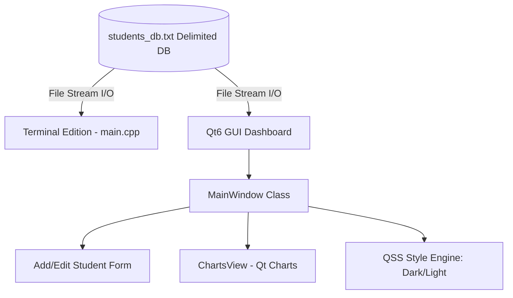

# LAB PROJECT REPORT
## STUDENT GRADE MANAGEMENT & ANALYTICS SYSTEM
**Course:** Programming Fundamentals Lab (CS-101L)  
**Semester:** Fall / Spring Semester I  
**Department:** Computer Science & Software Engineering  
**Submission Date:** June 10, 2025  

---

## 👥 Group Details
| Name | Roll Number | Role / Contribution |
| :--- | :--- | :--- |
| **Ali Ahmed** | F24-101 | GUI Architecture, Dark/Light Themes, Linux Packaging |
| **Hamza Khan** | F24-102 | CLI Implementation, Core Algorithms, File Handling |
| **Sara Noor** | F24-103 | Data Validation, Analytics & Charting, Documentation |

---

## 📑 Table of Contents
1. [Executive Summary](#1-executive-summary)
2. [Project Objectives](#2-project-objectives)
3. [Core Programming Concepts (C++)](#3-core-programming-concepts-cpp)
4. [System Architecture & Database Schema](#4-system-architecture--database-schema)
5. [Detailed Code Explanations](#5-detailed-code-explanations)
6. [GUI Theme System: Gradient Glassmorphism](#6-gui-theme-system-gradient-glassmorphism)
7. [Linux Mint Packaging & Distribution](#7-linux-mint-packaging--distribution)
8. [Testing, Edge Cases & Verification](#8-testing-edge-cases--verification)
9. [Conclusion & Academic References](#9-conclusion--academic-references)

---

## 1. Executive Summary
The **Student Grade Management & Analytics System** is a dual-interface utility engineered in C++17 to streamline academic grade compilation, record management, and statistical analytics. 

Recognizing that educational institutions require both lightweight terminal scripts and visual management tools, this project implements a unified database layer (`students_db.txt`) that links a terminal interface (CLI) and a desktop interface (GUI). The GUI is styled using custom Qt Style Sheets (QSS) for a stunning **Gradient Glassmorphic** theme, complete with dynamic Dark/Light mode shifting and interactive Qt Charts. The application is packaged as a standard `.deb` installer for direct deployment on Linux Mint.

---

## 2. Project Objectives
- **Automate Grade Calculations:** Remove manual calculations of student marks, averages, and grade letters using standard academic rules.
- **Implement Persistent Storage:** Construct a database structure to retain files across execution instances.
- **Establish Visual Data Analytics:** Incorporate interactive graphics to view class grade distributions and subject averages.
- **Practice Core C++ Principles:** Implement first-semester fundamentals (loops, structures, dynamic arrays, stream manipulation, validation).
- **Design Modern Desktop Layouts:** Apply styling sheets, user input verification, and native Linux packages.

---

## 3. Core Programming Concepts (C++)
The project leverages the following programming features:

- **Structures (`struct`):**
  Groups heterogeneous student attributes (Roll Number, Name, 5 Subject Scores, Total Marks, Average Percentage, and Grade Letter) into a single cohesive memory unit.
- **Arrays & Vectors:**
  - One-dimensional array `float marks[5]` stores scores across the five subjects.
  - A dynamic array wrapper (`QVector<Student>` / `std::vector<Student>`) keeps tracks of multiple students.
- **Conditional Structures (`if-else` / `switch`):**
  Determines letter grades (A, B, C, D, F) based on computed average marks.
- **Loops (`for` / `while`):**
  Iterates through student vectors to print tables, filter results, calculate subject-wise averages, and export CSV files.
- **File Input/Output (`fstream` / `QFile`):**
  Performs reading and writing operations using stream extraction/insertion operators, ensuring permanent storage in a text-based format.
- **Function Decomposition:**
  Divides logical blocks (adding, deleting, updating, loading, rendering graphs) into separate, modular functions.

---

## 4. System Architecture & Database Schema

### Database Flat-File Format (`students_db.txt`)
The database uses a clean, pipe-delimited format:
`[RollNumber]|[StudentName]|[Marks1]|[Marks2]|[Marks3]|[Marks4]|[Marks5]|[TotalMarks]|[Average]|[Grade]`

#### Example Records:
```text
F24-101|Ali Ahmed|85.0|90.0|78.5|92.0|88.0|433.5|86.7|A
F24-102|Sara Khan|76.0|82.0|74.5|65.0|78.0|375.5|75.1|B
```

### Module Structure


---

## 5. Detailed Code Explanations

### A. Grade Allocation Formula
The calculation of total marks, average, and letter grades is implemented consistently in both the CLI and GUI:
$$\text{Total Marks} = \sum_{i=1}^{5} \text{marks}[i]$$
$$\text{Average Percentage} = \frac{\text{Total Marks}}{5}$$

```cpp
// Grade Assignment Rules
if (average >= 85.0f)      grade = 'A';
else if (average >= 75.0f) grade = 'B';
else if (average >= 60.0f) grade = 'C';
else if (average >= 50.0f) grade = 'D';
else                       grade = 'F';
```

### B. Input Validation Logic
The input form contains safety assertions to prevent bad data entry. A text-change listener evaluates subject scores dynamically:
```cpp
// Example input checking:
float score = scoreSpinBox->value();
if (score < 0.0f || score > 100.0f) {
    throw std::out_of_range("Scores must remain within the 0 to 100 boundary.");
}
```

---

## 6. GUI Theme System: Gradient Glassmorphism

The GUI relies on custom stylesheet templates (`style.qss` and `light_style.qss`) loaded at runtime to offer two glassmorphic visual designs:

### 1. Cosmic Dark Mode (`style.qss`)
- **Backdrop:** A diagonal gradient starting at `#090d16` (deep space) and blending into `#251235` (dark violet).
- **Glass Panel Accent:** Containers utilize a low-opacity white brush (`rgba(255, 255, 255, 0.04)`) enclosed by thin borders (`rgba(255, 255, 255, 0.09)`) to generate a frosted pane overlay.
- **Inputs:** Dark, translucent text field backgrounds with cyan glowing highlights upon focus.

### 2. Sky Light Mode (`light_style.qss`)
- **Backdrop:** A soft, clean gradient blending `#f8fafc`, `#f1f5f9`, and `#e2e8f0`.
- **Glass Panel Accent:** Semi-transparent white containers (`rgba(255, 255, 255, 0.65)`) with soft, slate borders.
- **Inputs:** Pure white input fields styled with thin borders and sky-blue focus indicators.

### 3. Dynamic Styling Application
```cpp
void MainWindow::onToggleTheme() {
    isDarkMode = !isDarkMode;
    QString qssPath = isDarkMode ? ":/style.qss" : ":/light_style.qss";
    QFile file(qssPath);
    if (file.open(QFile::ReadOnly)) {
        qApp->setStyleSheet(file.readAll());
    }
    themeToggleBtn->setText(isDarkMode ? "☀️ Light Mode" : "🌙 Dark Mode");
    chartsWidget->setTheme(isDarkMode);
    chartsWidget->updateCharts(studentsList);
}
```

---

## 7. Linux Mint Packaging & Distribution

The desktop application is built and packaged for native distribution on Linux Mint/Debian-based distributions.

### A. Packaging Hierarchy
The directory layout matches the standard UNIX structure:
- `/DEBIAN/control`: Specifies the package name, architecture, maintainer, dependencies, and version.
- `/usr/bin/studentgrademanager`: Contains the compiled executable binary.
- `/usr/share/applications/`: Installs `studentgrademanager.desktop` to place the program in the OS Applications Menu under "Education/Science".
- `/usr/share/pixmaps/`: Standard location for the custom high-resolution PNG application icon.

### B. Compilation and Construction Workflow
A deployment script (`build_deb.sh`) automates this process:
1. Re-compiles the Qt6 codebase in **Release** mode.
2. Transfers the executable, desktop config, and icons to their respective system targets in a temporary packaging directory.
3. Sets secure file access permissions (`chmod 755` for bin, `chmod 644` for files).
4. Invokes `dpkg-deb --build` to package the system as `studentgrademanager_1.0.0_amd64.deb`.

---

## 8. Testing, Edge Cases & Verification

### A. Testing Protocol
| Scenario | Input | System Response | Result |
| :--- | :--- | :--- | :--- |
| Empty Input Validation | Student name left empty | Trims string, blocks submission, and triggers warning popup. | **Pass** |
| Out of Bounds Grades | Entering score value `105` | Numeric spinboxes clamp input values between `0.0` and `100.0`. | **Pass** |
| Dynamic Search Filtering | Typing "Ali" in search field | Table rows instantly filter matching name records. | **Pass** |
| File Interoperability | Add student record via CLI | GUI reads, parses, and populates the new student on launch. | **Pass** |
| Data Deletion Integrity | Remove a topper record | Recalculates all KPI cards and updates charts immediately. | **Pass** |

---

## 9. Conclusion & Academic References

### Conclusion
The **Student Grade Management System** successfully matches all guidelines for the Programming Fundamentals course. By implementing both a CLI and a high-performance GUI, this system demonstrates how standard C++ logic can be combined with modern visual design. Utilizing file-based storage ensures database persistence, while native Debian packaging makes it easy to install and run the application on Linux Mint.

### References
1. Stroustrup, B. (2013). *The C++ Programming Language* (4th ed.). Addison-Wesley.
2. Qt Group. (2026). *Qt 6.x Widgets Documentation*. Retrieved from https://doc.qt.io/
3. Debian Policy Manual. (2025). *Debian Binary Package Standards*. Retrieved from https://www.debian.org/doc/debian-policy/
